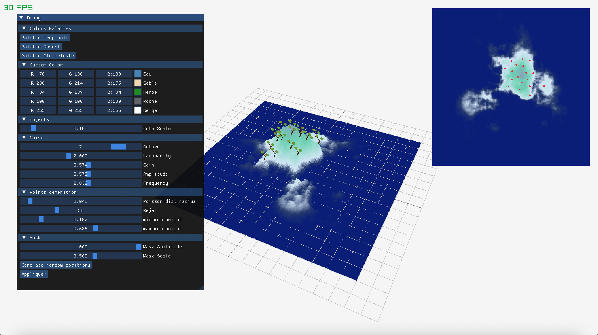
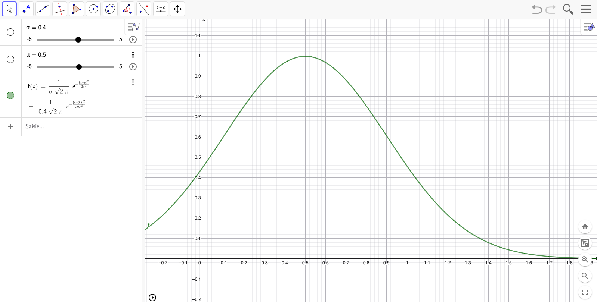
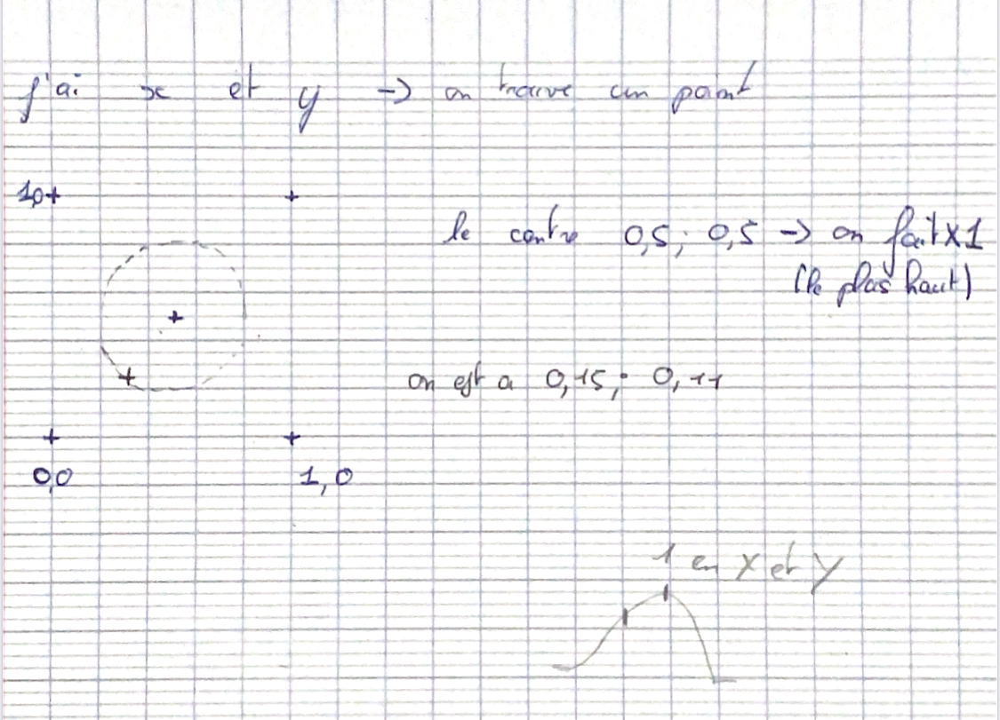
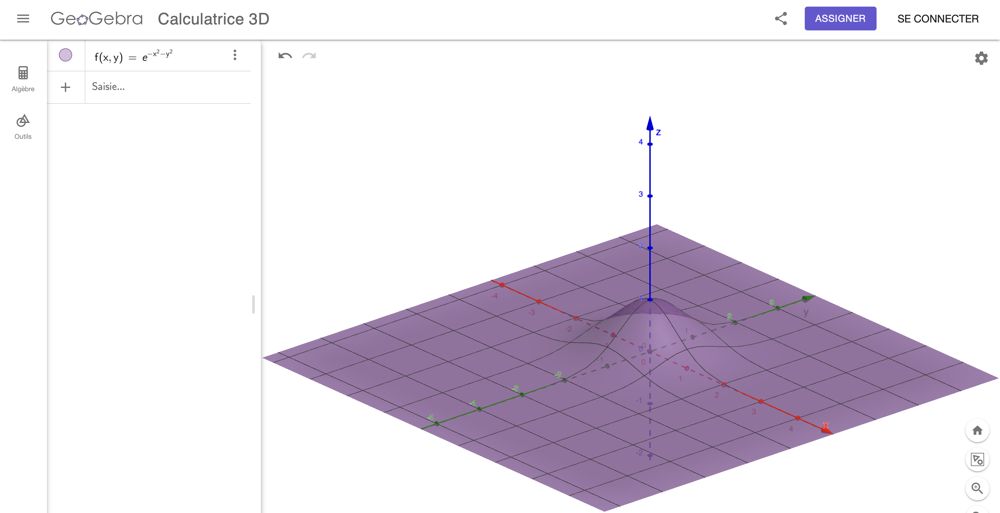

# ile celeste ☁️

Projet réalisé par Benoît Baraille, Alexandre Grosdidier, Romane Jouvet et developpé sur macOS

## Résultat

## 1) Bruit fractal

Pour le noise, je suis parti sur le tutoriel de The Book of Shaders et je l’ai intégré.
Le point un peu bloquant a été quand on appelle une fonction dans une autre fonction.
Je ne comprenais pas bien le principe, mais Jules Fouchy me l’a expliqué ! (Fun fact : c’est le même système dans Coollab !)
Après, j’ai ajouté une ImGui, sans oublier d’ajouter un bouton "Appliquer", sinon ça ne recharge pas les fonctions.

## 2) Génération de heightmap et couleurs

Pour le masque, je suis parti de la fonction gaussienne trouvée sur Wikipédia. Je l’ai ensuite utilisée dans GeoGebra afin de tester différents paramètres et de mieux comprendre son fonctionnement.

Cependant, nous avons besoin de points ((x, y)). Il nous faut donc une fonction gaussienne bidimensionnelle, que j’ai trouvée sur ce site : [Fonction gaussienne bidimensionnelle](https://wikiland.org/fr/Gaussian_function).

J’ai également ajouté un facteur permettant de moduler l’intensité de la fonction, afin que les valeurs soient nulles sur tous les bords et qu’aucune île n’apparaisse.

## 3) Distribution de points par Poisson disk sampling

J’ai suivi point par point la vidéo tutoriel de Sebastian Lague pour implémenter le Poisson Disk Sampling.
Au départ, je pensais que la grid_size était de 800 par 800, en pensant que c’était la taille en pixels de la fenêtre de l'application. J’avais donc normalisé les valeurs à la fin pour être entre 0 et 1. Mais après réflexion, je suis simplement parti directement de 0 à 1, ce qui évite toute conversion inutile.
Ensuite, ce tutoriel m’a permis de découvrir de nouvelles fonctions incluses dans la bibliothèque standard en C++. Par exemple, la fonction ceil, qui permet d’arrondir au nombre supérieur.
J’ai également adapté le tutoriel en effectuant les modifications nécessaires dans la struct.

## 4) Importation et génération d'arbres

Pour remplacer les cubes présents dans le projet de base, j'ai importé un modèle 3D d'arbre au format .obj à l'aide de Raylib. Ce modèle est chargé au démarrage de l'application puis affiché aux positions générées par l'algorithme de Poisson Disk Sampling.

Pour obtenir un rendu plus naturel, j'ai ajouté une rotation différente pour chaque arbre autour de l'axe vertical (axe Y). Pour cela, l'angle de rotation est calculé à partir de la position de l'arbre, ce qui permet d'obtenir une orientation différente pour chaque arbre tout en conservant un résultat identique entre deux générations.

Cette amélioration permet d'éviter que tous les arbres soient orientés dans la même direction et donne un aspect plus réaliste à la végétation de l'île.