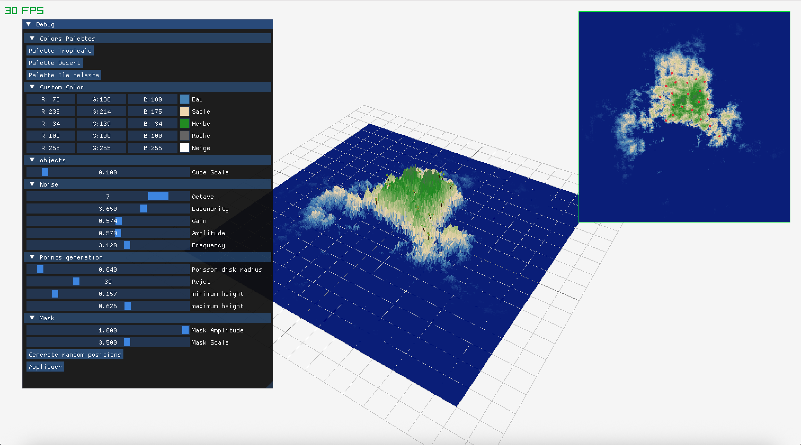
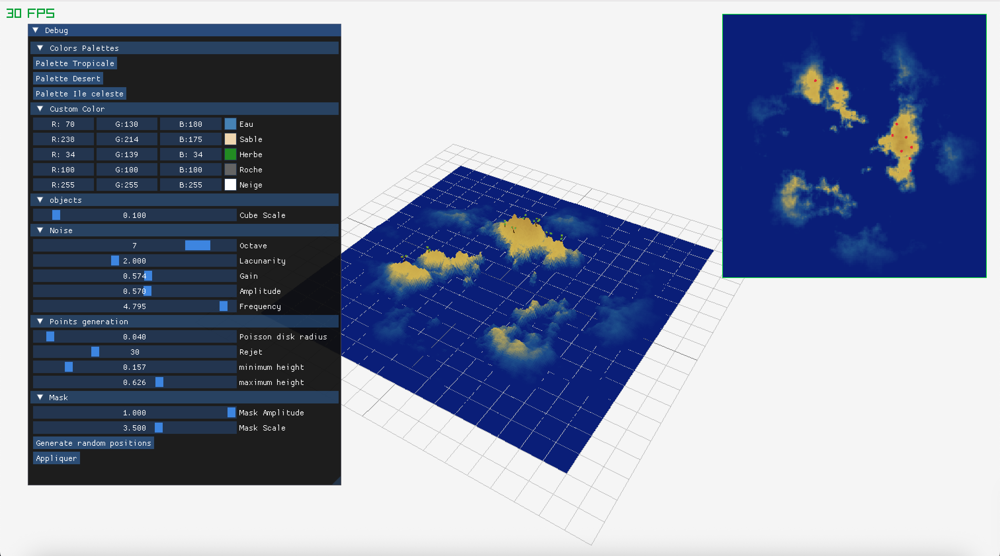
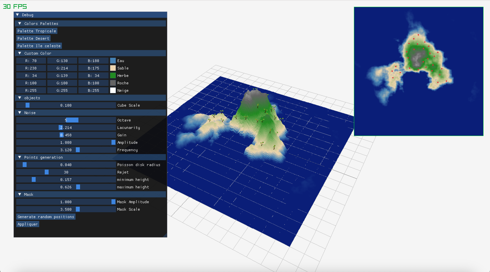

# Ile celeste ☁️

Projet réalisé par Benoît Baraille, Alexandre Grosdidier, Romane Jouvet et developpé sur macOS

[Lien vers le rapport](https://docs.google.com/document/d/1Huf5Xu_5gK-BY1kQTZir8-NeNJDJKROrweMMHT_AiXE/edit?usp=sharing) (le même que le ReadMe)

## Résultat


## Les choix algorithmiques faits

Nous avons utilisé une génération procédurale basée sur du bruit (noise) afin de créer des îles de manière automatique. Les différents paramètres permettent de contrôler la forme générale du terrain, le niveau de détail ainsi que le relief.

## Les paramètres retenus et leur impact visuel

Les paramètres que nous avons finalement retenus lors de nos tests sont les suivants :

```cpp
int noiseSeed{0};
float noiseScale{4.0f};
int resolution{256};
int octaves{7};
float lacunarity{2.0f};
float gain{0.574f};
float amplitude{0.570f};
float frequency{2.832f};
```

Ces valeurs permettent de générer une île assez globale avec des minis îles sur le côté. Le relief reste assez doux et naturel. On observe pas de falaises rocheuses, car l'amplitude choisie n'est pas suffisamment élevée pour créer des variations d'altitude très marquées.

Pour lacunarity, il vaut mieux ne pas trop la modifier, car elle fait rapidement basculer le terrain vers quelque chose de très montagneux, avec des variations d'altitude importantes et peu naturelles.



La Frequency définit véritablement la forme de l'île. Plus on l'augmente, plus on obtient plusieurs îles distinctes.



L’amplitude contrôle directement la hauteur du terrain. En l'augmentant, on peut faire apparaître des reliefs élevés avec des zones rocheuses.



Concernant les octaves, d'après mes tests, une valeur entre 4 et 7 donne les meilleurs résultats (bon équilibre entre variation et finesse, sans que le terrain ne devienne trop chaotique.)

## 1) Bruit fractal

Pour le noise, je suis parti sur le tutoriel de The Book of Shaders et je l’ai intégré.
Le point un peu bloquant a été quand on appelle une fonction dans une autre fonction.
Je ne comprenais pas bien le principe, mais Jules Fouchy me l’a expliqué ! (Fun fact : c’est le même système dans Coollab !)
Après, j’ai ajouté une ImGui, sans oublier d’ajouter un bouton "Appliquer", sinon ça ne recharge pas les fonctions.

## 2) Génération de heightmap et couleurs

Pour le masque, je suis parti de la fonction gaussienne trouvée sur Wikipédia. Je l’ai ensuite utilisée dans GeoGebra afin de tester différents paramètres et de mieux comprendre son fonctionnement.


Cependant, nous avons besoin de points ((x, y)). Il nous faut donc une fonction gaussienne bidimensionnelle, que j’ai trouvée sur ce site : [Fonction gaussienne bidimensionnelle](https://wikiland.org/fr/Gaussian_function).

J’ai également ajouté un facteur permettant de moduler l’intensité de la fonction, afin que les valeurs soient nulles sur tous les bords et qu’aucune île n’apparaisse.


## 3) Distribution de points par Poisson disk sampling

J’ai suivi point par point la vidéo tutoriel de Sebastian Lague pour implémenter le Poisson Disk Sampling.
Au départ, je pensais que la grid_size était de 800 par 800, en pensant que c’était la taille en pixels de la fenêtre de l'application. J’avais donc normalisé les valeurs à la fin pour être entre 0 et 1. Mais après réflexion, je suis simplement parti directement de 0 à 1, ce qui évite toute conversion inutile.
Ensuite, ce tutoriel m’a permis de découvrir de nouvelles fonctions incluses dans la bibliothèque standard en C++. Par exemple, la fonction ceil, qui permet d’arrondir au nombre supérieur.
J’ai également adapté le tutoriel en effectuant les modifications nécessaires dans la struct.

## 4) Importation et génération d'arbres

Pour remplacer les cubes présents dans le projet de base, j'ai importé un modèle 3D d'arbre au format .obj à l'aide de Raylib. Ce modèle est chargé au démarrage de l'application puis affiché aux positions générées par l'algorithme de Poisson Disk Sampling.

Pour obtenir un rendu plus naturel, j'ai ajouté une rotation différente pour chaque arbre autour de l'axe vertical (axe Y). Pour cela, l'angle de rotation est calculé à partir de la position de l'arbre, ce qui permet d'obtenir une orientation différente pour chaque arbre tout en conservant un résultat identique entre deux générations.

Cette amélioration permet d'éviter que tous les arbres soient orientés dans la même direction et donne un aspect plus réaliste à la végétation de l'île.

## Post-mortem

**Qu'est-ce qui a bien fonctionné, quels ont été les problèmes rencontrés, comment les avez-vous surmontés, et que feriez-vous différemment ?**

L’un des plus gros problèmes rencontrés a été l’implémentation du Poisson Disk Sampling. C’était assez complexe à mettre en place. Pour y parvenir, j’ai repris la vidéo explicative étape par étape et j’ai également demandé de l’aide à Jules, qui m’a aidé à débuguer le problème.

Grâce à l’aide de d'enguerrand, j’ai aussi pu comprendre le problème lié au radial mask. En réalité, celui-ci fonctionnait correctement, mais il ne s’affichait pas aux bonnes coordonnées. Je pensais au départ que le problème venait d’une mauvaise normalisation. Cependant, après plusieurs vérifications, tout indiquait le contraire. Enguerrand m’a alors conseillé d’afficher uniquement le radial mask, ce qui m’a permis de comprendre qu’il fallait déplacer la gaussienne. En effet, comme on pouvait le voir sur les représentations 3D, son maximum n’était pas situé en (0.5 ; 0.5). J’ai donc corrigé ce point en recentrant et en normalisant correctement la fonction.

**Avec plus de temps, qu'est-ce que vous pourriez ajouter ?**

Avec plus de temps, nous aurions aimé ajouter la fonctionnalité des biomes. Cependant, je pense qu’il aurait également été nécessaire de revoir la génération des îles. En effet, avec notre implémentation actuelle, nous générons principalement une seule île compacte plutôt qu’un ensemble d’îles distinctes. Une telle génération aurait permis d’associer plus facilement différents biomes à différentes zones de la carte.

Un peu dessus, ne pas avoir le temps d'implémenter la fonctionnalité de bruit de perlin. J’ai gardé la fonctionnalité de bruit de base, qui est un random.

Également, un point améliorable dans l’implémentation concerne la fonction de radial mask. Cette dernière ne descend pas en valeurs négatives. J’ai remarqué que certains groupes avaient réussi à obtenir des "fonds marins", avec une profondeur réelle sous l'eau, alors que dans notre cas le terrain part de zéro au niveau de la mer et remonte ensuite pour former les îles. Il n'y a donc aucune profondeur sous-marine.

**Comment s'est passée la répartition du travail dans le groupe ?**

La répartition du travail s’est globalement bien passée. Il a toutefois fallu une bonne organisation, notamment pendant la semaine d’élection auxquelles Romane et Alexandre participaient.
Chaque membre du groupe avait une fonctionnalité principale à développer. Nous discutions régulièrement des difficultés rencontrées, puis fusionnions notre travail au fur et à mesure.

Dans l’ensemble, j’ai trouvé que nous avions suffisamment de temps pour réaliser les fonctionnalités principales, même si certaines nous ont demandé plusieurs jours de travail, notamment le Poisson Disk Sampling qui a posé plusieurs problèmes au début.

Malgré cela, nous avons réussi à terminer les éléments principaux du projet ainsi que quelques améliorations supplémentaires.